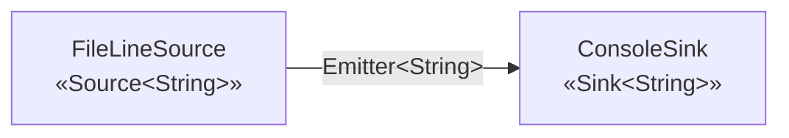

# LogFlow — Architecture (v1)

**Student:** Mohamad Yamen Kabalan — 2404040356

## Architectural style

LogFlow uses the **Pipe-and-Filter** style. Data flows in one direction:
a *Source* produces records, zero or more *Stages* (filters) transform them,
and a *Sink* consumes them. Components never call each other directly —
they only know the **Emitter** (the connector) they push items into.

## Two-box diagram (v1)

```
 ┌──────────────────────┐                     ┌──────────────────────┐
 │    FileLineSource    │      Emitter        │     ConsoleSink      │
 │   «Source<String>»   │ ──────────────────▶ │    «Sink<String>»    │
 │ reads file line by   │   (String lines)    │  prints every line   │
 │ line                 │                     │                      │
 └──────────────────────┘                     └──────────────────────┘
            ▲                                             ▲
            └───────────── assembled and run by ──────────┘
                              Pipeline / Main
```



In v1 the stage list is empty, so the source is connected directly to the sink.

## Components and connectors

| Element | Kind | Responsibility |
|---|---|---|
| `Source<O>` | component interface | Produces records into an emitter |
| `Stage<I,O>` | component interface | Transforms one input into 0..n outputs |
| `Sink<I>` | component interface | Consumes records at the end of the pipe |
| `Emitter<T>` | **connector** interface | Pushes an item to the next element |
| `Record` | data concept | The unit that flows through the pipe (a `String` line in v1) |
| `Pipeline` | configuration / runner | Holds the ordered stages and wires emitters together |
| `Main` | entry point | Reads args, assembles the pipeline, calls `run()` |

## Interface vs. implementation

The `core` package contains only interfaces. `FileLineSource` and `ConsoleSink`
are *implementations* in the `io` package. `Pipeline` depends only on the
interfaces, so a different source (e.g. network, stdin) or sink (e.g. file,
database) can be plugged in without changing `Pipeline`.

## Why `process` uses an `Emitter` instead of a return value

A stage may produce **zero, one, or many** outputs for one input:

- a filter drops a line → 0 outputs
- a parser converts a line → 1 output
- a splitter breaks a line into fields → many outputs

A return value would force a 1:1 mapping. The emitter removes that restriction.

## How `run()` works

`Pipeline.run()` builds a chain of emitters from the end backwards:
the last emitter calls `sink.consume`, each earlier one calls
`stage.process(item, next)`. The source is then given the first emitter.
Stages are `open()`ed before running and `close()`d afterwards (in reverse order).

## Next increments

The value of the pipeline is not visible yet — this is expected at week one.
Later increments add stages (parsing, filtering, aggregation) **without
changing** the source, sink, or pipeline.
