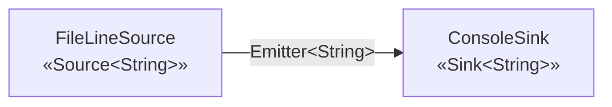
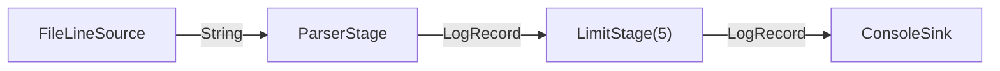

# LogFlow — Architecture (v2)

**Student:** Mohamad Yamen Kabalan — 2404040356

## Architectural style

LogFlow uses the **Pipe-and-Filter** style. Data flows in one direction:
a *Source* produces records, zero or more *Stages* (filters) transform them,
and a *Sink* consumes them. Components never call each other directly —
they only know the **Emitter** (the connector) they push items into.

## Two-box diagram (v1)

```
 ┌──────────────────────┐                     ┌──────────────────────┐
 │    FileLineSource    │      Emitter        │     ConsoleSink      │
 │   «Source<String>»   │ ──────────────────▶ │    «Sink<String>»    │
 │ reads file line by   │   (String lines)    │  prints every line   │
 │ line                 │                     │                      │
 └──────────────────────┘                     └──────────────────────┘
            ▲                                             ▲
            └───────────── assembled and run by ──────────┘
                              Pipeline / Main
```



The pipeline contains one stage, `LimitStage(5)`, between the two boxes, so only
the first 5 lines reach the sink:

```
FileLineSource ──Emitter──▶ LimitStage(5) ──Emitter──▶ ConsoleSink
```

The limit is a stage, not an `if` in `Main` — `Main` only assembles the pipeline.
`LimitStage` also uses the `open()` lifecycle hook to reset its counter.

## Components and connectors

| Element | Kind | Responsibility |
|---|---|---|
| `Source<O>` | component interface | Produces records into an emitter |
| `Stage<I,O>` | component interface | Transforms one input into 0..n outputs |
| `Sink<I>` | component interface | Consumes records at the end of the pipe |
| `Emitter<T>` | **connector** interface | Pushes an item to the next element |
| `Record` | data concept | The unit that flows through the pipe |
| `LogRecord` | domain model | Immutable parsed log entry (v2), implements `Record` |
| `ParserStage` | component | `String` → `LogRecord`; skips and counts malformed lines |
| `Pipeline` | configuration / runner | Holds the ordered stages and wires emitters together |
| `Main` | entry point | Reads args, assembles the pipeline, calls `run()` |

## Interface vs. implementation

The `core` package contains only interfaces. `FileLineSource` and `ConsoleSink`
are *implementations* in the `io` package. `Pipeline` depends only on the
interfaces, so a different source (e.g. network, stdin) or sink (e.g. file,
database) can be plugged in without changing `Pipeline`.

## Why `process` uses an `Emitter` instead of a return value

A stage may produce **zero, one, or many** outputs for one input:

- a filter drops a line → 0 outputs
- a parser converts a line → 1 output
- a splitter breaks a line into fields → many outputs

A return value would force a 1:1 mapping. The emitter removes that restriction.

## How `run()` works

`Pipeline.run()` builds a chain of emitters from the end backwards:
the last emitter calls `sink.consume`, each earlier one calls
`stage.process(item, next)`. The source is then given the first emitter.
Stages are `open()`ed before running and `close()`d afterwards (in reverse order).

## v2 — From strings to a domain model

```
FileLineSource ──▶ ParserStage ──▶ LimitStage(5) ──▶ ConsoleSink
   «Source<String>»   «Stage<String,LogRecord>»  «Stage<LogRecord,LogRecord>»  «Sink<LogRecord>»
```



**Separation of concerns.** Reading (`FileLineSource`), understanding (`ParserStage`),
selecting (`LimitStage`) and presenting (`ConsoleSink` + `LogRecordFormatter`) are four
different classes. Each can be tested and replaced on its own.

**Inserting a stage in the middle.** `ParserStage` was added between the source and
`LimitStage`. `FileLineSource`, `LimitStage`, `Pipeline` and the `core` interfaces were
**not changed** — only `Main` (assembly) and `ConsoleSink` (how a record is shown).
`LimitStage` is generic (`LimitStage<T>`), so it works on `LogRecord` exactly as it did on `String`.
The limit sits *after* the parser so that every line of the file is parsed and counted.

**`LogRecord` is immutable** — final fields, an unmodifiable copy of the attributes map,
created through a Builder (Java 8 has no `record` type). A record can be shared by any
number of stages without one stage changing what another sees. `toBuilder()` creates a
modified copy.

**The `attributes` map is the extension point.** In weeks 5–7, new stages will attach data
that today's parser knows nothing about (e.g. geo-location, classification, error info).
They put it into `attributes` instead of adding new fields, so the record format is open
for extension without changing `LogRecord` or `ParserStage` (Open/Closed principle).
The parser already uses it for optional data: `protocol`, `query`, `referer`, `ident`, `user`.

**Malformed lines.** In v2 they are only skipped and counted (`ParserStage.malformedCount()`);
`Main` prints the total at the end. Proper error handling is deliberately left for week 5 —
the architecture is built layer by layer.

**Testing without files.** A stage only knows the `Emitter` interface. Tests therefore
create the stage, call `process("…a log line…", collector)` and inspect the
`CollectingEmitter` test double. No file, source, sink or pipeline is needed, which makes
the tests fast, deterministic, and focused on one stage.

## Next increments

The value of the pipeline is not visible yet — this is expected at week one.
Later increments add stages (parsing, filtering, aggregation) **without
changing** the source, sink, or pipeline.
